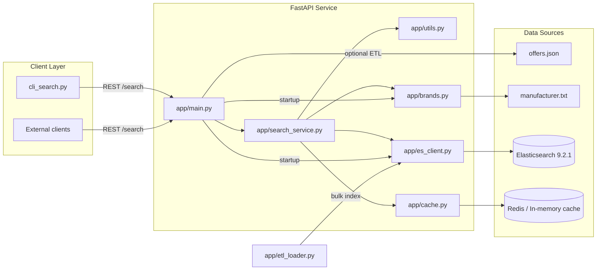
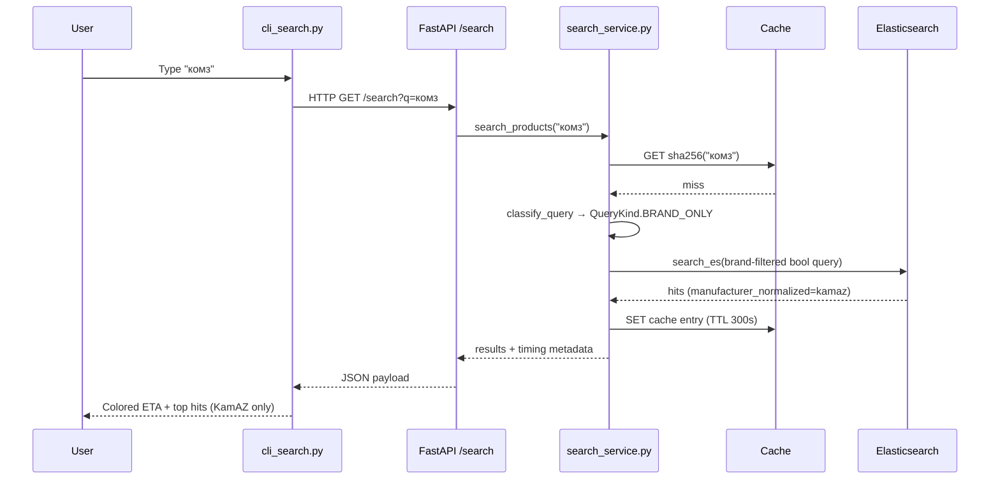

# Search System Architecture

This document explains how the product search service is wired from data
ingestion to query serving. It is organized to mirror the repository structure
so each section points to the concrete module that implements the step.

## High-level overview

At startup FastAPI initializes the brand dictionary, ensures Elasticsearch has
an index (and optionally bulk-loads offers), and prepares the cache backend.
Every query then flows through classification, cache lookup, ES search, and
response serialization.

## Data ingestion pipeline (`app/etl_loader.py`)

1. **Data acquisition**: `ensure_data_file` downloads `offers.json` if it is
   missing and a source URL was configured.
2. **Document preparation**: `_prepare_document` builds search-friendly fields:
   - `search_text` concatenates manufacturer, product code, and title.
   - `search_text_tr` stores a transliterated copy for cross alphabet matches.
   - `product_code_normalized` strips non-alphanumerics and uppercases codes
     for deterministic article lookups.
   - `manufacturer_normalized` pipes the manufacturer through
     `normalize_manufacturer`, which tries to resolve brands via the fuzzy
     dictionary before falling back to a cleaned token.
3. **Indexing**: `index_documents` streams the prepared docs into the
   Elasticsearch `products` index using the bulk helper.

## Brand knowledge base (`app/brands.py`)

* `load_manufacturers` reads `manufacturer.txt`, ignoring blank/commented
  lines.
* `build_brand_index` tokenizes every line, chooses a canonical token, and
  records all aliases in `canonical_by_variant` / `synonyms_by_canonical`.
* `_variant_forms` adds transliteration variants in both directions (ru→en and
  en→ru) so every canonical brand includes Russian, Latin, and mirrored spellings.
* `find_brand_for_token` tries overrides (e.g., «комз»→`kamaz`), exact
  matches, and finally a `rapidfuzz` best-match search with score guards,
  ensuring misspelled tokens still resolve to the intended brand.
* Helper getters expose canonical brand lists so classifiers and ETL code reuse
  the same view of the brand universe.

## Normalization & classification helpers (`app/utils.py`)

* `normalize_code` and `normalize_manufacturer` derive canonical representations
  for product codes and manufacturers. The latter tries fuzzy brand detection
  first, then transliterates, and only then falls back to static synonyms.
* `transliterate_query` switches between Cyrillic and Latin representations so
  mixed-alphabet user queries can match either version of a token.
* `extract_url_tokens` and `is_probable_article_query` detect structured inputs
  (URLs and articles) and pre-normalize them before search.
* `detect_brand_tokens` tokenizes queries, generates token variants (raw,
  normalized, transliterated), and passes them through `find_brand_for_token`.
  It returns canonical brand IDs and remembers the original token so the search
  service can preserve the user’s spelling for scoring.
* `classify_query` orchestrates the above and emits `QueryClassification`:
  - URLs → `QueryKind.URL`
  - Article-like strings → `QueryKind.ARTICLE`
  - Tokens containing only brands → `QueryKind.BRAND_ONLY`
  - Brand + generic tokens → `QueryKind.BRAND_WITH_GENERIC`
  - No brands → `QueryKind.GENERIC_ONLY`
  The classification also stores `generic_tokens`, normalized codes, and URL
  tokens for downstream use.

## Elasticsearch client & index (`app/es_client.py`)

* `create_index_if_not_exists` provisions the `products` index with:
  - `ru_en_search` analyzer for bilingual stemming/stop words.
  - `brand_phonetic_analyzer` leveraging the phonetic plugin for Double
    Metaphone matches.
  - Fields for `manufacturer`, `title`, `search_text`, transliteration, and
    normalized product codes, with phonetic sub-fields where relevant.
* `search_es` runs the constructed query body, while `get_client` lazily
  configures the `Elasticsearch` instance against the configured host.

## Cache layer (`app/cache.py`)

* `get_cache` first tries Redis; if unavailable it falls back to an in-memory
  dict guarded by a lock and TTL timestamps.
* Both `RedisCache` and `InMemoryCache` expose `get/set` so the search service
  can treat them identically. Cache keys are SHA-256 hashes of the raw query.

## Search execution (`app/search_service.py`)

The `search_products` function coordinates the full request lifecycle:

1. **Cache lookup**: the SHA-256 hash of the raw query becomes the cache key.
   Cache hits short-circuit the remaining steps and log a cheap timing entry.
2. **Classification**: `classify_query` identifies URLs, articles, and brand
   intent.
3. **Query building** (`build_es_query`): constructs a bool query with
   `track_total_hits=false` and field-specific logic:
   - Article queries prioritize `product_code_normalized` and `title`.
   - URL queries run `multi_match` over `search_text` and transliterated text.
   - Brand-only queries filter on `manufacturer_normalized`, add boosted
     `manufacturer`/phonetic matches, and treat the raw brand string as a soft
     ranking hint.
   - Brand+generic queries add both the brand filter and a boosted generic
     `multi_match` clause so parts like «ступица» influence ranking.
   - Generic queries fall back to a standard fuzzy `multi_match` over
     `title`, `search_text`, and `product_code`.
   Transliteration matches optionally add phonetic should-clauses to catch
   mismatched alphabets.
4. **Execution & serialization**: results from Elasticsearch are trimmed to the
   `_source` fields, converted into lightweight dicts, and stored with the
   measured `took_ms` and overall `eta_ms`.
5. **Timing logs**: every stage (classification, query building, ES call,
   post-processing) is timed with `perf_counter()` and logged, which makes it
   easy to spot SLA regressions.
6. **Caching**: fresh responses are cached for `settings.cache_ttl_seconds`
   (default 5 minutes), keeping hot queries under a millisecond after the first
   hit.

## FastAPI layer (`app/main.py`)

* Startup event initializes the brand index, creates the ES index, and can
  optionally load offers when configured.
* `/health` reports ES status.
* `/search` validates the query string, delegates to `search_products`, and
  returns a typed `SearchResponse` that includes the detected `classification`
  and the ETA used by the CLI coloring.
* `/reindex` re-runs the ETL loader on demand.

## CLI client (`cli_search.py`)

* Offers interactive and batch modes to hit `GET /search`.
* Prints the ETA in green when under 0.2 s and red otherwise, mirroring the SLA.
* Shows the top 100 hits (configurable via `MAX_RESULTS`) for quick smoke tests
  using `queries_example.txt`.

## Request lifecycle example

This flow demonstrates how spelling mistakes are corrected before hitting
Elasticsearch, guaranteeing that «комз», «камаз», and «kamaz» all reuse the same
brand filter and therefore return identical inventories.

## Configuration knobs

* `app/config.py` exposes environment overrides for ES host/index, cache TTL,
  search result size, and optional download URLs for the data files.
* `settings.brand_result_size` caps brand-specific result sets so brand-only
  searches stay fast.
* `settings.load_on_startup` toggles whether the ETL runs automatically when the
  service boots.

## Extending the system

* Add new brands by appending lines to `manufacturer.txt`; the next startup will
  rebuild the index with the added synonyms.
* Adjust fuzzy sensitivity or transliteration rules inside `app/brands.py` when
  introducing domains with different naming conventions.
* Extend the search response by editing `app/models.py`—the FastAPI route and
  CLI already deserialize the same schema.
* Add new query types by extending `QueryKind` and branching inside
  `classify_query` and `build_es_query`.
