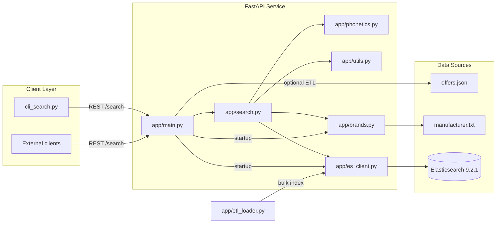
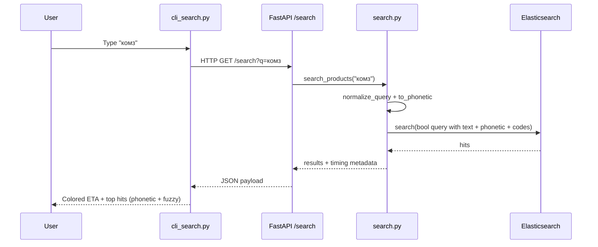

# Search System Architecture

This document explains how the product search service is wired from data
ingestion to query serving. It is organized to mirror the repository structure
so each section points to the concrete module that implements the step.

## High-level overview

At startup FastAPI initializes the brand dictionary, ensures Elasticsearch has
an index (and optionally bulk-loads offers). Each query goes through lightweight
normalization, phonetic encoding, Elasticsearch search, and response
serialization without any cache or branching execution paths.

## Data ingestion pipeline (`app/etl_loader.py`)

1. **Data acquisition**: `ensure_data_file` downloads `offers.json` if it is
   missing and a source URL was configured.
2. **Document preparation**: `_prepare_document` builds search-friendly fields:
   - `search_text` concatenates manufacturer, product code, and title.
   - `search_text_tr` stores a transliterated copy for cross alphabet matches.
   - `product_code_normalized` strips non-alphanumerics and uppercases codes
     for deterministic article lookups.
   - `manufacturer_brand_tokens` stores the canonical brand IDs detected inside
     the manufacturer line (e.g., `TOYOTA-LEXUS` → `["toyota", "lexus"]`).
   - `manufacturer_normalized` reuses the first canonical brand ID so legacy
     consumers still have a single-string view.
3. **Indexing**: `index_documents` streams the prepared docs into the
   Elasticsearch `products` index using the bulk helper.

## Brand knowledge base (`app/brands.py`)

`app/brands.py` turns the noisy `manufacturer.txt` dump into a structured brand
catalog:

* Each brand is represented by `Brand(id, labels, tokens)`, where `labels` keep
  the raw spellings from the file and `tokens` are normalized Latin strings.
* `_is_noise_line` and `_split_segments` drop article-like prefixes (e.g.,
  `CA1698373 ...`) and split multi-brand rows (`TOYOTA-LEXUS`).
* `normalize_brand_token` lowercases, replaces `ё/й`, transliterates Russian
  characters, strips punctuation, and applies typo overrides so «тоёта»,
  «тайота», «leksus», «кэт», «caterpilar» all collapse to canonical IDs such as
  `toyota`, `lexus`, or `caterpillar`.
* Brand parsing is two-phased: `_collect_candidates` gathers every clean
  manufacturer label, tokenizes it, and tracks detailed statistics (solo
  occurrences, uppercase frequency, hyphen usage, plus whether the original
  label used Cyrillic or Latin letters). `_select_trusted_tokens` combines those
  stats with an expanded vocabulary of known generic nouns (масло, жидкость,
  блок, пыльник, …) to drop descriptive tokens and keep only things that behave
  like proper names.
* `build_brand_catalog` then registers each candidate whose tokens intersect
  the trusted set, producing two maps: `brand_id -> Brand` and
  `token -> brand_id` for O(1) lookups.
* `extract_brand_ids_from_text` reuses the same tokenizer for manufacturers at
  index time, skips the generic nouns before fuzzy matching, and
  `detect_brands_in_query` performs query-time detection so the classifier and
  Elasticsearch share a single brand universe.

### Lifecycle summary

1. **Startup** — `load_brand_catalog` parses `manufacturer.txt`, persists the
   resulting dictionaries in memory, and exposes helper accessors.
2. **Index time** — `extract_brand_ids_from_text` is called from the ETL loader
   for each manufacturer string so documents store `manufacturer_brand_tokens`.
3. **Query time** — `detect_brands_in_query` tokenizes the user input, applies
   deterministic overrides (Toyota/Lexus/Lukoil/Caterpillar/etc.), optionally
   triggers Damerau–Levenshtein matching against the canonical token list, and
   emits both canonical ids and untouched generic tokens (for Cyrillic search).
4. **Logging** — helper functions in `app.utils` keep transliteration and
   article normalization consistent between ETL and search.

## Normalization helpers (`app/utils.py`)

* `normalize_code` removes non-alphanumeric characters and uppercases product
  codes for deterministic lookups.
* `transliterate_query` switches between Cyrillic and Latin alphabets so
  `search_text_tr` can stay aligned with the primary text fields.

## Elasticsearch client & index (`app/es_client.py`)

* `create_index_if_not_exists` provisions the `products` index with:
  - `ru_en_search` analyzer for bilingual stemming/stop words.
  - `brand_phonetic_analyzer` leveraging the phonetic plugin for Double
    Metaphone matches.
  - Fields for `manufacturer`, `title`, `search_text`, transliteration,
    normalized product codes, and an optional `manufacturer_brand_tokens`
    keyword array for future brand metadata.
* `search_es` runs the constructed query body, while `get_client` lazily
  configures the `Elasticsearch` instance against the configured host.

## Search execution (`app/search.py`)

`search_products` handles the end-to-end request lifecycle without branching or
cache layers:

1. **Normalization** — `normalize_query` lowercases input, collapses repeated
   letters, applies static brand synonyms, and harmonizes digraphs so latin
   `sch`/`sh` map to the same Cyrillic sound before phonetics.
2. **Phonetics** — `to_phonetic` transliterates the normalized string to Latin
   characters and runs double metaphone, yielding stable phonetic tokens even
   for mixed alphabets.
3. **Query building** — `_build_query` assembles a bool query with parallel
   `multi_match` clauses for text fields, optional phonetic fields, and product
   codes, plus a low-weight `match_all` to keep `minimum_should_match=1`
   satisfied when inputs are empty.
4. **Execution & serialization** — Elasticsearch runs the query once; results
   are flattened into lightweight dicts that keep the score and original source
   fields for FastAPI/CLI consumers.

## FastAPI layer (`app/main.py`)

* Startup event initializes the brand index, creates the ES index, and can
  optionally load offers when configured.
* `/health` reports ES status.
* `/search` validates the query string, delegates to `search_products`, and
  returns a typed `SearchResponse` with the normalized query echo, results, and
  timing for CLI coloring.
* `/reindex` re-runs the ETL loader on demand.

## CLI client (`cli_search.py`)

* Offers interactive and batch modes to hit `GET /search`.
* Prints the ETA in green when under 0.2 s and red otherwise, mirroring the SLA.
* Shows the top 100 hits (configurable via `MAX_RESULTS`) for quick smoke tests
  using `queries_example.txt`.

## Request lifecycle example

This flow demonstrates how spelling mistakes are corrected before hitting
Elasticsearch: «комз», «камаз», and «kamaz» all normalize to the same text and
phonetic keys so the bool query produces comparable inventories.

## Configuration knobs

* `app/config.py` exposes environment overrides for ES host/index, mapping and
  synonyms paths, the offers file location, `LOAD_ON_STARTUP`, and `LOG_LEVEL`.
* `settings.load_on_startup` toggles whether the ETL runs automatically when the
  service boots.

## Extending the system

* Add new brands by appending lines to `manufacturer.txt`; the next startup will
  rebuild the brand catalog used during ETL.
* Adjust fuzzy sensitivity or transliteration rules inside `app/brands.py` when
  introducing domains with different naming conventions.
* Extend the search response by editing `app/models.py`—the FastAPI route and
  CLI already deserialize the same schema.

---

# Архитектура системы (RU)

Эта секция дублирует ключевые моменты на русском языке.

## Основные компоненты

* **FastAPI (`app/main.py`)** — эндпоинты `/health`, `/search`, `/reindex` и запуск загрузки данных при старте.
* **Поиск (`app/search.py`)** — нормализует запрос, строит фонетический ключ и генерирует один `bool`-запрос в Elasticsearch.
* **Фонетика (`app/phonetics.py`)** — статические синонимы + диграфы (``sch`` → ``ш`` и т. п.), translit + double metaphone.
* **Бренды и ETL (`app/brands.py`, `app/etl_loader.py`)** — готовят `search_text`, артикула и вспомогательные брендовые токены при загрузке `offers.json`.
* **Elasticsearch (`app/es_client.py`)** — создаёт индекс с анализаторами `ru_en_search` и `brand_phonetic`, подтягивает синонимы из `config/brand_synonyms.txt`.

## Поток запроса

1. Клиент дергает `/search?q=...`.
2. `normalize_query` приводит строку к нижнему регистру, схлопывает повторы, применяет синонимы и подменяет `sch`/`sh` → `ш`, `zh` → `ж`, `ch` → `ч`.
3. `to_phonetic` транслитерирует результат в латиницу и вычисляет metaphone.
4. `_build_query` добавляет `multi_match` по текстовым полям, опциональную фонетическую часть, поиск по артикулам и `match_all` с маленьким бустом.
5. Elasticsearch отдаёт результаты один раз; FastAPI возвращает плоские dict с `_score` и исходными полями.

## Настройки

* `ES_HOST`, `ES_INDEX`, `MAPPING_PATH`, `SYNONYMS_PATH`, `OFFERS_PATH`, `LOAD_ON_STARTUP`, `LOG_LEVEL` — основные env-переменные (см. `app/config.py`).

## Где смотреть детали

* `ARCHITECTURE.md` — структура приложения и точки расширения.
* `SCORING_AND_SEARCH.md` — формулы для `_score`, порядок выполнения запросов, влияние фонетики.
