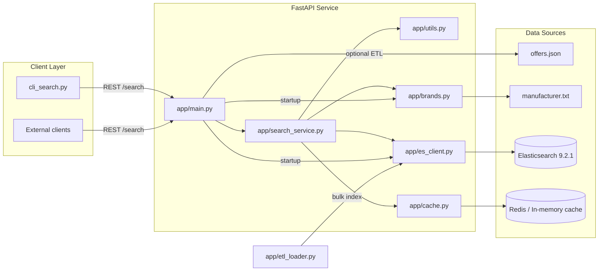
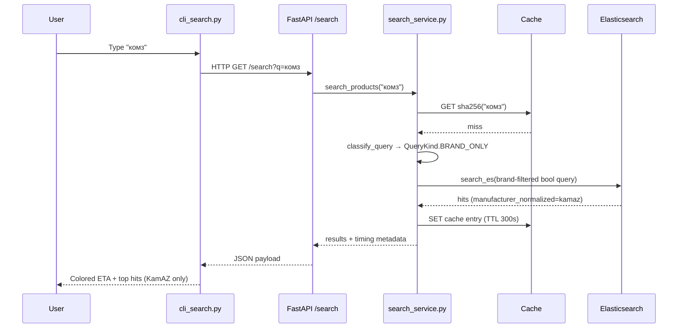

# Search System Architecture

This document explains how the product search service is wired from data
ingestion to query serving. It is organized to mirror the repository structure
so each section points to the concrete module that implements the step.

## High-level overview

At startup FastAPI initializes the brand dictionary, ensures Elasticsearch has
an index (and optionally bulk-loads offers), and prepares the cache backend.
Every query then flows through classification, cache lookup, ES search, and
response serialization.

## Data ingestion pipeline (`app/etl_loader.py`)

1. **Data acquisition**: `ensure_data_file` downloads `offers.json` if it is
   missing and a source URL was configured.
2. **Document preparation**: `_prepare_document` builds search-friendly fields:
   - `search_text` concatenates manufacturer, product code, and title.
   - `search_text_tr` stores a transliterated copy for cross alphabet matches.
   - `product_code_normalized` strips non-alphanumerics and uppercases codes
     for deterministic article lookups.
   - `manufacturer_brand_tokens` stores the canonical brand IDs detected inside
     the manufacturer line (e.g., `TOYOTA-LEXUS` → `["toyota", "lexus"]`).
   - `manufacturer_normalized` reuses the first canonical brand ID so legacy
     consumers still have a single-string view.
3. **Indexing**: `index_documents` streams the prepared docs into the
   Elasticsearch `products` index using the bulk helper.

## Brand knowledge base (`app/brands.py`)

`app/brands.py` turns the noisy `manufacturer.txt` dump into a structured brand
catalog:

* Each brand is represented by `Brand(id, labels, tokens)`, where `labels` keep
  the raw spellings from the file and `tokens` are normalized Latin strings.
* `_is_noise_line` and `_split_segments` drop article-like prefixes (e.g.,
  `CA1698373 ...`) and split multi-brand rows (`TOYOTA-LEXUS`).
* `normalize_brand_token` lowercases, replaces `ё/й`, transliterates Russian
  characters, strips punctuation, and applies typo overrides so «тоёта»,
  «тайота», «leksus», etc. collapse to canonical IDs.
* Brand parsing is two-phased: `_collect_candidates` gathers every clean
  manufacturer label, tokenizes it, and tracks detailed statistics (solo
  occurrences, uppercase frequency, hyphen usage, plus whether the original
  label used Cyrillic or Latin letters). `_select_trusted_tokens` combines those
  stats with an expanded vocabulary of known generic nouns (масло, жидкость,
  блок, пыльник, …) to drop descriptive tokens and keep only things that behave
  like proper names.
* `build_brand_catalog` then registers each candidate whose tokens intersect
  the trusted set, producing two maps: `brand_id -> Brand` and
  `token -> brand_id` for O(1) lookups.
* `extract_brand_ids_from_text` reuses the same tokenizer for manufacturers at
  index time, skips the generic nouns before fuzzy matching, and
  `detect_brands_in_query` performs query-time detection so the classifier and
  Elasticsearch share a single brand universe.

## Normalization & classification helpers (`app/utils.py`)

* `normalize_code` still handles deterministic article normalization, while
  `transliterate_query` switches between Cyrillic and Latin alphabets for generic
  fuzzy search.
* `detect_brands_in_query` (from `app/brands.py`) is wired directly into
  `classify_query`, so every query produces canonical brand IDs alongside both
  normalized and raw non-brand tokens for downstream ranking.
* `extract_url_tokens` and `is_probable_article_query` detect structured inputs
  (URLs and articles) and pre-normalize them before search.
* `classify_query` orchestrates the above and emits `QueryClassification`:
  - URLs → `QueryKind.URL`
  - Article-like strings → `QueryKind.ARTICLE`
  - Tokens containing only brands → `QueryKind.BRAND_ONLY`
  - Brand + generic tokens → `QueryKind.BRAND_WITH_GENERIC`
  - No brands → `QueryKind.GENERIC_ONLY`
  The classification also stores `non_brand_terms`, normalized codes, and URL
  tokens for downstream use.

## Elasticsearch client & index (`app/es_client.py`)

* `create_index_if_not_exists` provisions the `products` index with:
  - `ru_en_search` analyzer for bilingual stemming/stop words.
  - `brand_phonetic_analyzer` leveraging the phonetic plugin for Double
    Metaphone matches.
  - Fields for `manufacturer`, `title`, `search_text`, transliteration,
    normalized product codes, and the new `manufacturer_brand_tokens` keyword
    array used for filtering/boosting.
* `search_es` runs the constructed query body, while `get_client` lazily
  configures the `Elasticsearch` instance against the configured host.

## Cache layer (`app/cache.py`)

* `get_cache` first tries Redis; if unavailable it falls back to an in-memory
  dict guarded by a lock and TTL timestamps.
* Both `RedisCache` and `InMemoryCache` expose `get/set` so the search service
  can treat them identically. Cache keys are SHA-256 hashes of the raw query.

## Search execution (`app/search_service.py`)

The `search_products` function coordinates the full request lifecycle:

1. **Cache lookup**: the SHA-256 hash of the raw query becomes the cache key.
   Cache hits short-circuit the remaining steps and log a cheap timing entry.
2. **Classification**: `classify_query` identifies URLs, articles, and brand
   intent.
3. **Query building** (`build_es_query`): constructs a bool query with
   `track_total_hits=false` and field-specific logic:
   - Article queries prioritize `product_code_normalized` and `title`.
   - URL queries run `multi_match` over `search_text` and transliterated text.
  - Brand-only queries filter on `manufacturer_brand_tokens`, add a boosted
    `constant_score` clause for those canonical IDs, and then use the brand
    labels to rank within the filtered set; if the filter returns zero hits the
    service automatically retries without the filter so the user still sees
    something useful.
  - Brand+generic queries first run with the same brand filter to guarantee
    brand-first ordering, but fall back to a boosted, filter-less query if the
    brand inventory is empty so mixed queries never return blank pages.
   - Generic queries fall back to a standard fuzzy `multi_match` over
     `title`, `search_text`, and `product_code`.
   Transliteration matches optionally add phonetic should-clauses to catch
   mismatched alphabets.
4. **Execution & serialization**: results from Elasticsearch are trimmed to the
   `_source` fields, converted into lightweight dicts, and stored with the
   measured `took_ms` and overall `eta_ms`. A deeper dive into the scoring stack
   (multi-match boosts, brand filters, constant-score clauses, phonetics, and the
   fallback plan) now lives in `SCORING_AND_SEARCH.md`.
5. **Timing logs**: every stage (classification, query building, ES call,
   post-processing) is timed with `perf_counter()` and logged, which makes it
   easy to spot SLA regressions.
6. **Caching**: fresh responses are cached for `settings.cache_ttl_seconds`
   (default 5 minutes), keeping hot queries under a millisecond after the first
   hit.

## FastAPI layer (`app/main.py`)

* Startup event initializes the brand index, creates the ES index, and can
  optionally load offers when configured.
* `/health` reports ES status.
* `/search` validates the query string, delegates to `search_products`, and
  returns a typed `SearchResponse` that includes the detected `classification`
  and the ETA used by the CLI coloring.
* `/reindex` re-runs the ETL loader on demand.

## CLI client (`cli_search.py`)

* Offers interactive and batch modes to hit `GET /search`.
* Prints the ETA in green when under 0.2 s and red otherwise, mirroring the SLA.
* Shows the top 100 hits (configurable via `MAX_RESULTS`) for quick smoke tests
  using `queries_example.txt`.

## Request lifecycle example

This flow demonstrates how spelling mistakes are corrected before hitting
Elasticsearch, guaranteeing that «комз», «камаз», and «kamaz» all reuse the same
brand filter and therefore return identical inventories.

## Configuration knobs

* `app/config.py` exposes environment overrides for ES host/index, cache TTL,
  search result size, and optional download URLs for the data files.
* `settings.brand_result_size` caps brand-specific result sets so brand-only
  searches stay fast.
* `settings.load_on_startup` toggles whether the ETL runs automatically when the
  service boots.

## Extending the system

* Add new brands by appending lines to `manufacturer.txt`; the next startup will
  rebuild the index with the added synonyms.
* Adjust fuzzy sensitivity or transliteration rules inside `app/brands.py` when
  introducing domains with different naming conventions.
* Extend the search response by editing `app/models.py`—the FastAPI route and
  CLI already deserialize the same schema.
* Add new query types by extending `QueryKind` and branching inside
  `classify_query` and `build_es_query`.

---

# Архитектура системы (RU)

Эта секция дублирует основные мысли документа на русском языке.

## Слои

* **FastAPI (`app/main.py`)** — маршруты `/search`, `/health`, `/reindex` и
  инициализация зависимостей.
* **Бренды (`app/brands.py`)** — чтение `manufacturer.txt`, очистка строк от
  артикулов/описаний, нормализация токенов (латиница + транслитерация, замена
  «ё/й», словари опечаток), статистика по каждому токену (отдельные
  вхождения, верхний регистр, латиница/кириллица, наличие дефиса) и отбор
  канонических идентификаторов. Генерируется две структуры: описание бренда и
  карта «токен → canonical id».
* **ETL (`app/etl_loader.py`)** — подготавливает документы для Elasticsearch:
  `search_text`, `search_text_tr`, нормализованные артикулы и массив
  `manufacturer_brand_tokens` для жёсткого фильтра.
* **Поиск (`app/search_service.py`)** — кэш, классификация (`classify_query`),
  сборка DSL, вызов Elasticsearch, повтор без фильтра (fallback) и логирование
  метрик. Подробности про скоуп запросов и `_score` описаны в
  `SCORING_AND_SEARCH.md`.
* **Кэш (`app/cache.py`)** — Redis или in-memory обёртка с TTL.
* **Elasticsearch (`app/es_client.py`)** — индекс `products` с анализаторами
  `ru_en_search` и `brand_phonetic`, а также полями `search_text_tr` и
  `manufacturer_brand_tokens`.

## Обработка запроса

1. Клиент вызывает `/search?q=...`.
2. `search_products` проверяет кэш и классифицирует запрос: URL, артикул, чистый
   бренд, бренд + дополнительные слова или generic.
3. В зависимости от класса собирается `bool`-запрос:
   * чистый бренд → `filter` по `manufacturer_brand_tokens` + `constant_score`
     буст + ранжирование по `manufacturer`/`title`;
   * бренд + описательные слова → тот же фильтр + `must` по non-brand термам;
     если документов мало, выполняется повтор без фильтра, но с большим
     `should`-бустом бренда;
   * generic → `multi_match` по `title`, `search_text`, `product_code` и
     дополнительный phonetic should для транслитерации;
   * статьи и URL имеют свои ветки.
4. Ответ сериализуется (id, manufacturer, product_code, title, score) и
   кэшируется. Логируются времена классификации, сборки, вызова ES и постобработки
   — SLA держим < 200 мс.

## Где смотреть детали

* `ARCHITECTURE.md` (этот файл) — структура приложения и точки расширения.
* `SCORING_AND_SEARCH.md` — формулы для `_score`, порядок выполнения запросов,
  объяснение fallback-логики.
