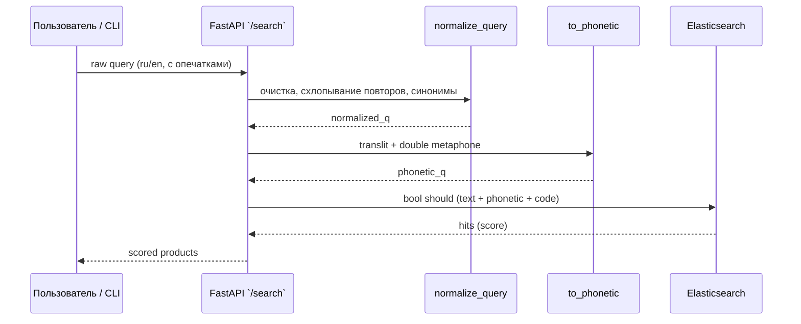
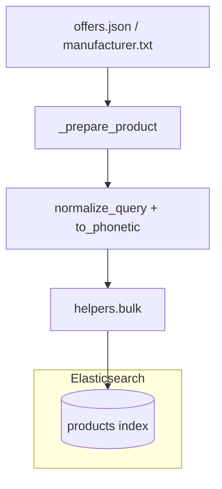

# SearchSystem: текстовая и фонетическая релевантность

Этот документ объясняет, как новая версия сервиса комбинирует нормализованный текстовый запрос и фонетический ключ, и когда требуется переиндексация Elasticsearch.

## Поток обработки запроса

**Шаги:**
1. `normalize_query` приводит строку к нижнему регистру, схлопывает повторяющиеся буквы, убирает лишние символы и подменяет разговорные бренды на канонические (`"мерс"` → `"мерседес"`).
2. `to_phonetic` принимает уже нормализованный текст, транслитерирует кириллицу в латиницу и кодирует двойным metaphone, чтобы «котерьпиллар» и «caterpillar» сходились в фонетике.
3. В запросе к ES одновременно используются текстовые поля (`title`, `manufacturer`, `autocomplete`, коды) и фонетические (`title.phonetic`, `manufacturer.phonetic`, `phonetic`) без какого-либо vector search.

## Индексация и данные

- Фонетическое представление для документа вычисляется так же, как и для запроса, чтобы совпадали токены.
- Индекс создаётся из `product-mapping.json` с морфологическими, автодополнениями и фонетическим анализатором (Beider–Morse) плюс файлом синонимов брендов `config/brand_synonyms.txt`.

## Нужно ли переиндексировать?

Переиндексация **нужна**, если:
- обновились файлы настроек (`product-mapping.json`, `config/brand_synonyms.txt`),
- изменилась логика нормализации/фонетики (нужно пересчитать поле `phonetic` у документов),
- загружены новые данные.

Как переиндексировать:
1. Убедитесь, что Elasticsearch запущен.
2. Вызовите `POST /reindex` у FastAPI: `curl -X POST http://localhost:8000/reindex`.
   Это удалит индекс, создаст его заново и заново загрузит данные из `offers.json`.

Если индекс уже создан и данные не менялись, переиндексация не требуется.
